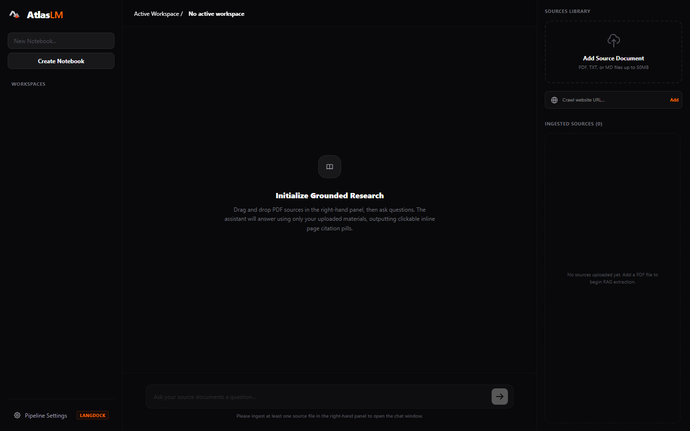
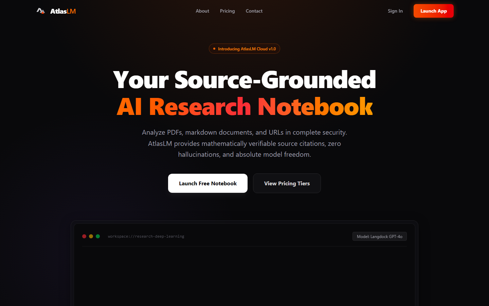
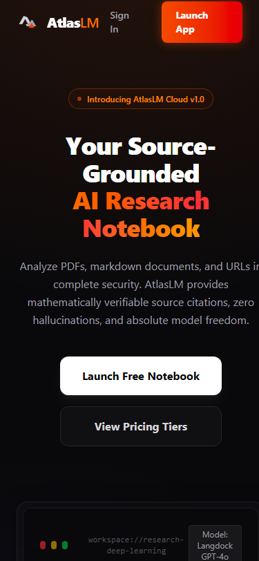
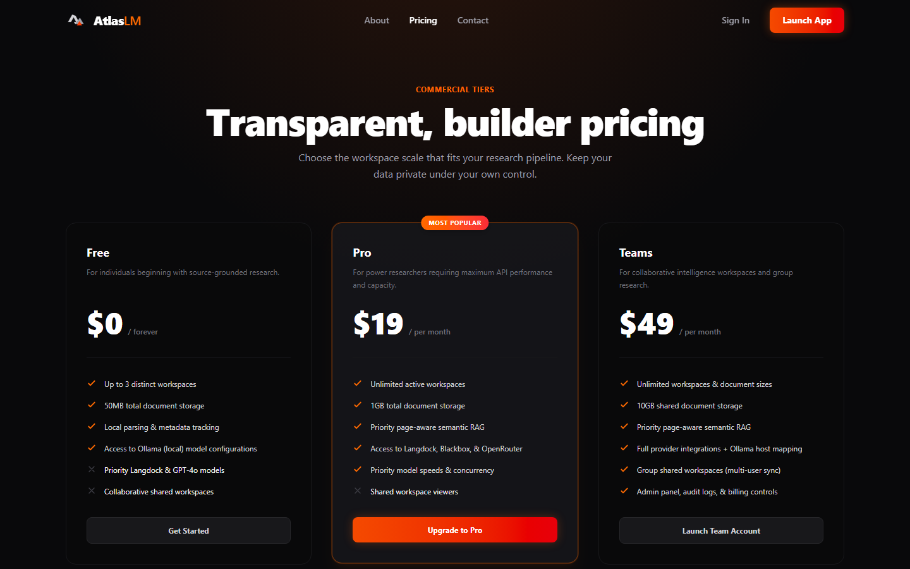
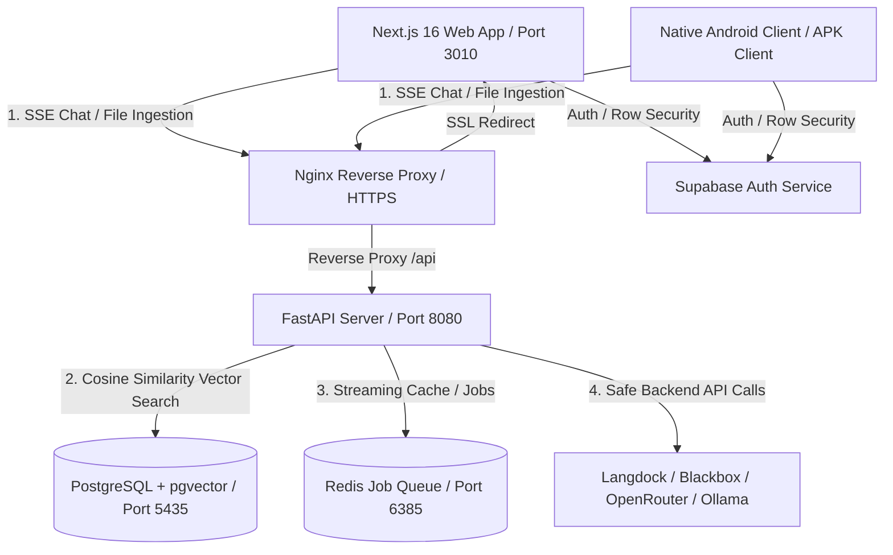

# 🌌 AtlasLM — Premium AI Knowledge Workspace

AtlasLM is a privacy-first, source-grounded, self-hosted AI research notebook inspired by NotebookLM. It is engineered for complete data ownership, model freedom, and secure local or production-grade knowledge workspaces.

Engage in real-time streaming conversations where every answer is mathematically cited directly back to your source documents. AtlasLM features sub-second page-by-page PDF parsing, cosine distance semantic search in PostgreSQL, and an isolated multi-model provider engine.

---

## 📸 High-Fidelity Visual Previews

### 1. The Research Workspace
A premium three-column dashboard inspired by Vercel, Linear, and Framer. Upload source documents, manage multiple notebook sessions, choose your active AI model provider, and view page-level citations in a dedicated sliding drawer.



### 2. Live Landing Page & Android Integration
Designed with a cinematic dark theme, glowing visual accents, and responsive layout grids. Features a professional "Install Android App" button linking to our future-ready native client APK route.



### 3. Mobile Responsive Canvas & Staging Onboarding
AtlasLM is engineered with fluid mobile layouts, ensuring an outstanding user experience on both desktop screens and mobile devices.

| Mobile Desktop Teaser | Pricing & Onboarding Tiers |
| :---: | :---: |
|  |  |

---

## 🚀 Core Features & Technical Strengths

* **🔒 Absolute Source-Grounding**: AtlasLM will NEVER hallucinate facts outside your uploaded source materials. If a query cannot be answered using the retrieved document context, the backend is strictly constrained to reply: *"I could not find that information in the uploaded sources."*
* **📄 Interactive Page citations**: Visual inline pills (e.g. `[1]`, `[2]`) in the chat window act as interactive buttons. Clicking any pill slides open a dedicated citation drawer, displaying the source filename, page number, and the exact matching document snippet.
* **⚡ Sub-Second Ingest Pipeline**: Deterministic page-by-page text parsing from PDFs using PyMuPDF (`fitz`), maintaining precise character-offset metadata and page lineage for 100% correct citations.
* **🌐 Multi-Model Abstraction**: Swappable model integrations supporting **Langdock**, **Blackbox AI**, **OpenRouter/Auto**, and fully offline local **Ollama** models.
* **🛡️ Client-Safe Security**: All API keys, database credentials, and provider settings reside securely inside your isolated Docker container backend. The clients (web and upcoming Android app) never touch secret keys and authenticate solely via Supabase Auth.
* **🤖 Native Android APK Readiness**: Landing and contact pages are fully wired to support direct APK downloads at `/download/android` once the native Android client goes live.

---

## 🏗️ System Architecture

AtlasLM uses a modern, containerized, microservices-based layout reverse-proxied under SSL via Nginx.



### 1. Ingestion Pipeline
1. **Upload**: User sends a PDF, Markdown, or TXT file or inputs a crawlable URL.
2. **Deterministic Extraction**: PyMuPDF extracts text page-by-page. A recursive text splitter segments content into chunks while appending precise `char_offset`, `page_number`, and `source_id` metadata.
3. **Embeddings**: FastAPI requests embeddings from the active model provider (e.g., `nomic-embed-text` or OpenAI embeddings).
4. **Vector Storage**: Chunk vectors are committed to PostgreSQL using `pgvector` index structures.

### 2. Retrieval-Augmented Generation (RAG)
1. **Search**: User query is embedded and matched against PostgreSQL vectors using Cosine Distance.
2. **Context Enrichment**: The top-$K$ matching chunks are formatted as a strict source context block.
3. **Structured Prompting**: A prompt template forces the model to answer *only* using the provided text blocks and to append `[source_N]` citation tokens matching the text indices.
4. **SSE Streaming**: Responses stream to the client via Server-Sent Events (SSE), parsing the inline `[source_N]` tokens on the fly into clickable visual badges.

---

## 💻 Installation & Quickstart

### Option A: One-Command Setup (Docker Compose)
*Requires Docker and Docker Compose.*

1. Clone the repository and navigate to the directory:
   ```bash
   git clone https://github.com/janpaul80/AtlasLM.git
   cd AtlasLM
   ```
2. Copy the environment variables template and configure your API keys:
   ```bash
   cp backend/.env.example backend/.env
   cp frontend/.env.example frontend/.env.local
   ```
3. Run the containerized ecosystem:
   ```bash
   docker-compose up --build -d
   ```
4. Access the applications:
   * **Next.js Web App**: `https://atlaslm.cloud` (or `http://localhost:3010` locally)
   * **FastAPI Server Docs**: `http://localhost:8080/docs`

---

### Option B: Local Development Setup

#### Prerequisites
* **Node.js**: v20+ and `npm` installed.
* **Python**: v3.11+ and `pip` installed.
* **PostgreSQL**: v16+ with `pgvector` enabled.

#### 1. Setup the Backend
```bash
cd backend
python -m venv .venv
source .venv/bin/activate  # On Windows (PowerShell): .venv\Scripts\Activate.ps1
pip install -r requirements.txt
cp .env.example .env
uvicorn app.main:app --host 127.0.0.1 --port 8000 --reload
```

#### 2. Setup the Frontend
```bash
cd ../frontend
npm install
cp .env.example .env.local
npm run dev
```
Open `http://localhost:3000` inside your browser.

---

## 🦙 Offline Local Models (Ollama Setup)

To use AtlasLM 100% offline without cloud API keys, configure local models:

1. Install [Ollama](https://ollama.com) on your local machine.
2. Download embedding and chat completion models:
   ```bash
   ollama pull nomic-embed-text
   ollama pull llama3
   ```
3. Edit your backend `.env` file to point to your Ollama endpoint:
   ```env
   OLLAMA_ENDPOINT_URL=http://localhost:11434
   ```
4. In the dashboard's **Pipeline Settings**, switch your active provider to `Ollama`.

---

## 📱 Future Native Android Client Architecture

The upcoming native Android application acts as a secure mobile gateway. In line with production-grade security, it is built with the following parameters:
* **No Local Secrets**: The Android APK does NOT contain any secret model keys or API credentials. All authentication is managed via Supabase, and RAG requests are routed through your secure, reverse-proxied FastAPI server.
* **Native Component Library**: High-fidelity native dashboard, document upload, and responsive citation drawers.
* **Host-Your-Own Wiring**: Easily change the mobile endpoint inside settings to connect the app to your own self-hosted server deployment.

---

## 🛡️ Security & Privacy Policies

* **Environment Separation**: Environment variables (`.env`, `.env.local`) are strictly excluded from git tracking via root `.gitignore` parameters.
* **Authentication Integrity**: Supabase JWT session verification actively protects row-level operations across multiple workspaces.
* **Staging Server Isolation**: Remote deployment runs inside isolated Docker subnets on port-secured staging boxes. Nginx handles standard SSL certificate handshakes, preventing plain HTTP sniffing.
