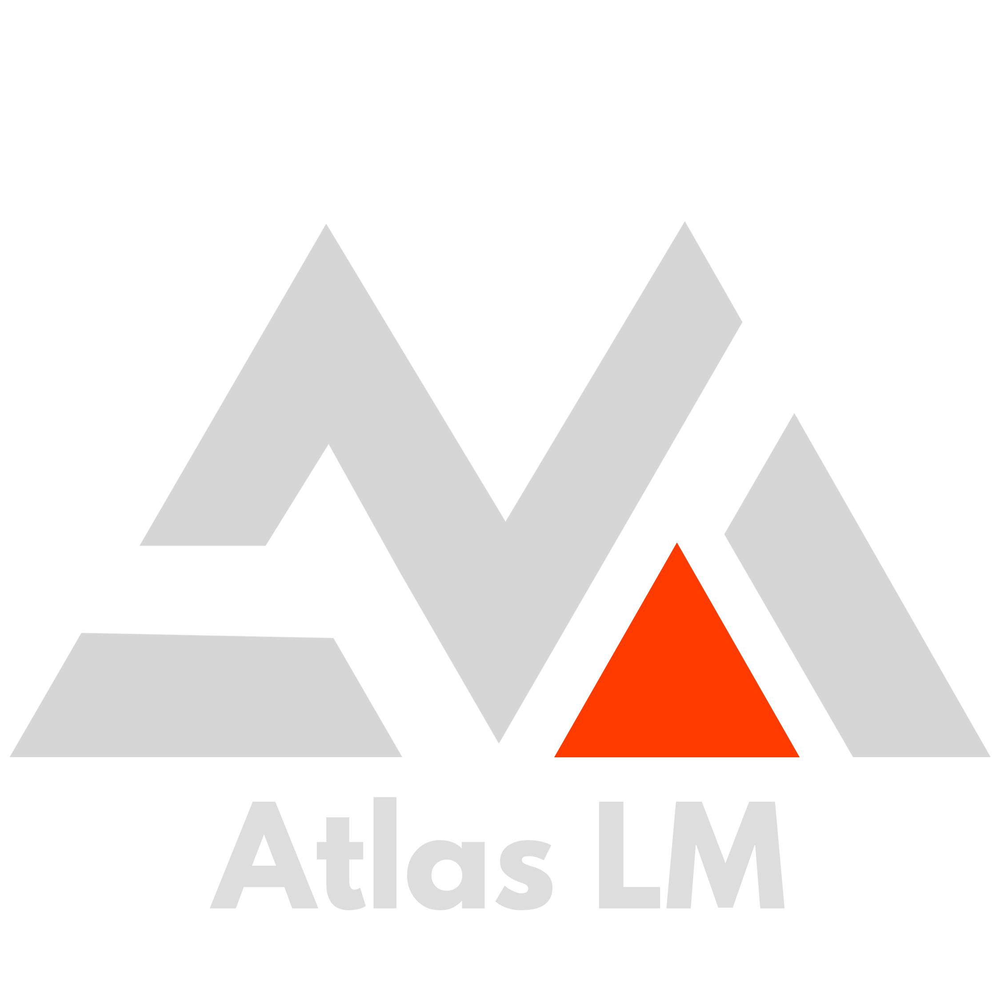
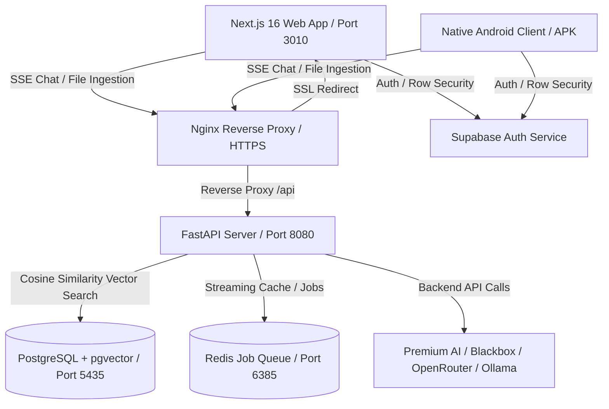

<p align="center">
  
</p>

<h1 align="center">AtlasLM</h1>
<p align="center"><strong>A privacy-first AI knowledge workspace with real citations.</strong></p>

---

AtlasLM is a self-hosted AI research notebook built for people who actually care about where their answers come from. Think of it as NotebookLM, but you own everything: the data, the models, the infrastructure.

Upload your PDFs, markdown files, or plain text. Ask questions. Get answers that cite the exact page and paragraph they came from. No hallucinations, no hand-waving, no black box.

---

## Screenshots

### The Workspace

Three-column dashboard for managing notebooks, chatting with your documents, and reviewing citations side by side.


### Landing Page


### Mobile + Pricing

| Mobile Layout | Pricing Tiers |
| :---: | :---: |
|  |  |

---

## What it does

- **Source-grounded answers only.** If the answer isn't in your uploaded documents, AtlasLM says so. It won't make things up.
- **Page-level citations.** Every response includes clickable citation badges (`[1]`, `[2]`) that open a side drawer showing the exact source text, filename, and page number.
- **Fast PDF ingestion.** Documents are parsed page by page using PyMuPDF with precise character offsets. Citations always point to the right page.
- **Multiple model providers.** Swap between premium cloud models, Blackbox AI, OpenRouter, or run fully offline with Ollama. Your choice.
- **Your keys stay on the server.** API keys and credentials live inside the Docker backend. The web client and mobile app never touch them. Auth goes through Supabase.
- **Android app (coming soon).** The landing page links to `/download/android` where the native APK will be available once it ships.

---

## Architecture

Containerized stack behind Nginx with SSL. Everything runs in Docker.



### How ingestion works

1. You upload a PDF, markdown file, or text file (or give it a URL to crawl).
2. PyMuPDF extracts text page by page. A recursive splitter breaks it into chunks and tags each one with the page number, character offset, and source ID.
3. The backend generates embeddings via your active model provider.
4. Vectors get stored in PostgreSQL with pgvector.

### How RAG works

1. Your question gets embedded and matched against stored vectors using cosine distance.
2. The top matching chunks become the context window.
3. A structured prompt forces the model to only use those chunks and to tag each claim with `[source_N]` tokens.
4. The response streams back via SSE. The frontend parses those tokens into clickable citation badges in real time.

---

## Getting started

### Docker (recommended)

You need Docker and Docker Compose installed.

```bash
git clone https://github.com/janpaul80/AtlasLM.git
cd AtlasLM
```

Set up your environment variables:

```bash
cp backend/.env.example backend/.env
cp frontend/.env.example frontend/.env.local
```

Start everything:

```bash
docker-compose up --build -d
```

Then open:
- **Web app:** `https://atlaslm.cloud` (or `http://localhost:3010` locally)
- **API docs:** `http://localhost:8080/docs`

---

### Local development

**Requirements:** Node.js 20+, Python 3.11+, PostgreSQL 16+ with pgvector.

#### Backend

```bash
cd backend
python -m venv .venv
source .venv/bin/activate  # Windows: .venv\Scripts\Activate.ps1
pip install -r requirements.txt
cp .env.example .env
uvicorn app.main:app --host 127.0.0.1 --port 8000 --reload
```

#### Frontend

```bash
cd ../frontend
npm install
cp .env.example .env.local
npm run dev
```

Open `http://localhost:3000`.

---

## Offline mode with Ollama

You can run AtlasLM completely offline without any cloud API keys.

1. Install [Ollama](https://ollama.com).
2. Pull the models you need:
   ```bash
   ollama pull nomic-embed-text
   ollama pull llama3
   ```
3. Set the endpoint in your backend `.env`:
   ```env
   OLLAMA_ENDPOINT_URL=http://localhost:11434
   ```
4. Switch the provider to Ollama in the dashboard settings.

---

## Android app (planned)

The native Android client will work as a secure mobile frontend. Key design decisions:

- **No secrets on the device.** The APK does not store API keys or credentials. Everything goes through your backend server.
- **Fully native UI.** Not a WebView wrapper. Real native components for uploads, chat, and citations.
- **Point it at your own server.** Change the endpoint in settings to connect to your self-hosted deployment.

---

## Security

- **Env files are gitignored.** `.env` and `.env.local` are excluded from version control.
- **Row-level security.** Supabase JWT tokens enforce workspace isolation. Users can only access their own data.
- **Isolated containers.** The staging deployment runs inside Docker with port-scoped networking. Nginx handles SSL termination.

---

## Built by

**Paul Hartmann** | [paulhartmann.dev](https://paulhartmann.dev)

