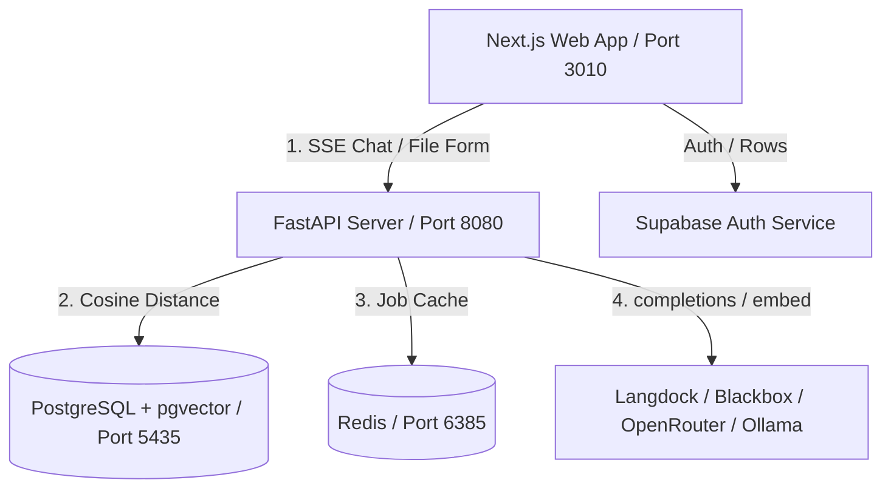

# AtlasLM — Premium AI Knowledge Workspace

AtlasLM is a privacy-first, source-grounded, self-hosted AI research notebook inspired by NotebookLM, but built for full privacy, data ownership, local deployment, and model freedom.

With AtlasLM, you can upload documents (PDFs, Markdown, TXT) or crawl websites, parse pages in sub-second times, store vectors in PostgreSQL with pgvector, and engage in streaming multiline chat where every answer is mathematically cited directly back to the source.

---

## 🚀 Key Features

* **Absolute Source-Grounding**: AtlasLM will NEVER hallucinate facts outside your uploaded source context. If the information isn't present, the AI answers exactly with: *"I could not find that information in the uploaded sources."*
* **Page-Aware Interactive Citations**: Clickable visual tags (e.g. `[1]`, `[2]`) in the chat window highlight and display exact page numbers and quoted snippets in the side explorer panel.
* **Modular Ingestion Pipeline**: Sub-second text extraction page-by-page from PDFs via PyMuPDF (`fitz`), clean character-offset metadata lineage, and batch vector generation.
* **Model & Provider Freedom**: Support for **Langdock**, **Blackbox AI**, **OpenRouter/Auto**, and fully offline local **Ollama** models.
* **Supabase Authentication**: Commercial-ready, secure onboarding and row-level access control.
* **Premium Cinematic Aesthetics**: High-end dark theme dashboard inspired by Vercel, Linear, and Framer, with custom scrollbars, glowing border effects, and responsive glassmorphism interfaces.

---

## 🏗️ System Architecture



---

## 💻 Installation & Quickstart

### Option A: One-Command Setup (Docker Compose)
*Requires Docker and Docker Compose installed.*

1. Clone the repository and navigate to the directory:
   ```bash
   git clone https://github.com/atlaslm/atlaslm.git
   cd atlaslm
   ```
2. Copy the environment variables template and configure your API keys:
   ```bash
   cp backend/.env.example backend/.env
   cp frontend/.env.example frontend/.env.local
   ```
3. Run the containerized ecosystem:
   ```bash
   docker-compose up --build -d
   ```
4. Access the applications:
   * **Next.js Web App**: `http://localhost:3010`
   * **FastAPI Server Docs**: `http://localhost:8080/docs`

---

### Option B: Local Setup (Windows PowerShell / WSL / Linux / macOS)

#### Prerequisites
* **Node.js**: v18+ and `npm` installed.
* **Python**: v3.11+ and `pip` installed.
* **PostgreSQL**: v16+ with `pgvector` enabled (listening on port `5435` or custom).

#### 1. Setup the Backend
Navigate to `/backend`, set up a virtual environment, and install requirements:
```bash
cd backend
python -m venv .venv

# On Windows (PowerShell):
.venv\Scripts\Activate.ps1
# On Linux/macOS/WSL:
source .venv/bin/activate

pip install -r requirements.txt
```
Copy and fill out the environment file:
```bash
cp .env.example .env
```
Run the FastAPI Uvicorn dev server:
```bash
uvicorn app.main:app --host 127.0.0.1 --port 8000 --reload
```

#### 2. Setup the Frontend
Open a new terminal, navigate to `/frontend`, and install dependencies:
```bash
cd frontend
npm install
```
Copy and configure the Supabase keys:
```bash
cp .env.example .env.local
```
Run the Next.js dev server:
```bash
npm run dev
```
Open `http://localhost:3000` inside your browser.

---

## 🦙 Running Local Models (Ollama Setup)

To use AtlasLM fully offline without cloud API keys, you can leverage local models:

1. Install [Ollama](https://ollama.com) on your local machine or server.
2. Download embedding and chat completion models:
   ```bash
   ollama pull nomic-embed-text
   ollama pull llama3
   ```
3. Set your backend `.env` file to point to your Ollama endpoint:
   ```env
   OLLAMA_ENDPOINT_URL=http://localhost:11434
   ```
4. Go to **Pipeline Settings** in the dashboard and set your model provider to `Ollama`.

---

## 🛠️ Troubleshooting & FAQs

### Q: Why does the chat say "I could not find that information in the uploaded sources"?
**A**: AtlasLM enforces strict source grounding. If your prompt refers to general facts or web knowledge not explicitly present inside the ingested documents in your active workspace, the model is strictly constrained to block hallucinations and return this message.

### Q: How do I map my custom domain?
**A**: An Nginx configuration file is provided in `/nginx/atlaslm.cloud`. Move this file to `/etc/nginx/sites-available/`, create a symbolic link in `/etc/nginx/sites-enabled/`, run Certbot to configure HTTPS, and reload Nginx.

---

## 🗺️ Phase 2 Roadmap
* **Native Android App**: Deploy a high-fidelity native APK (no webview wrappers) interacting with the secure `/api/v1` routes.
* **Advanced Document Parsers**: Add OCR backup for scanned PDFs, alongside DOCX/PPTX structures.
* **Shared Workspace Collaboration**: Team notebooks with multi-user sync and administrative audit logs.
